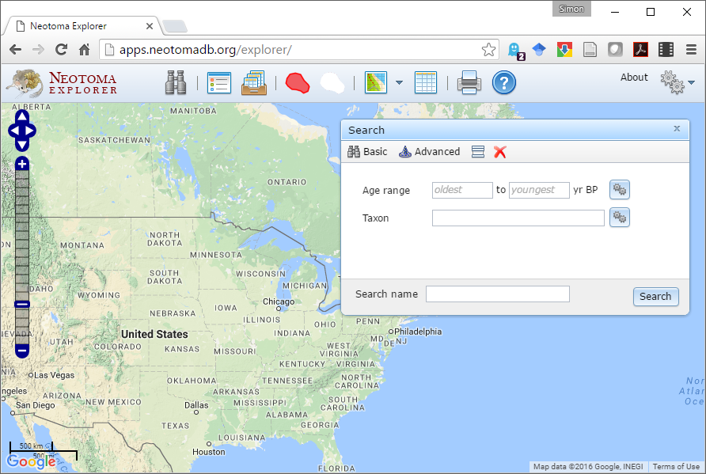
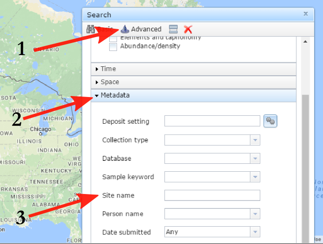
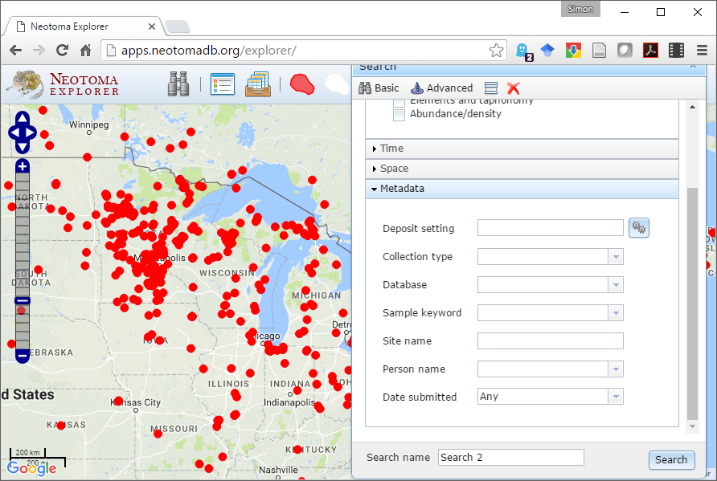
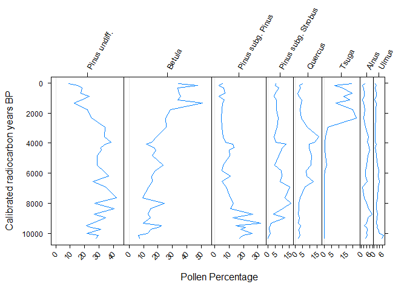
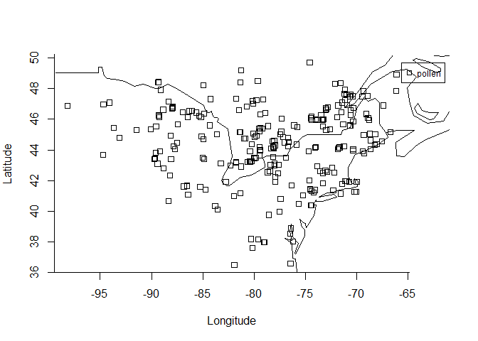
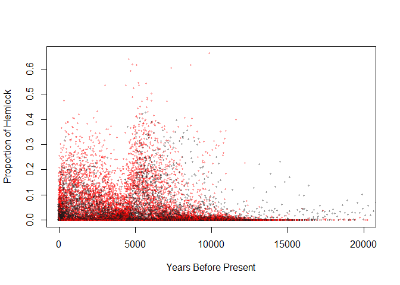

# PalEON 2016: Neotoma DB, Explorer, and R
Jack Williams & Simon Goring  
`r format(Sys.time(), '%d %B, %Y')`  

# Introduction

This workshop is intended to introduce individuals to the Neotoma Paleoecology Database, Neotoma Explorer, and the  'neotoma' package in R. Neotoma is a public-access and community-supported repository of paleoecological data, mostly from the late Quaternary. These paleoecological data are widely used by scientists to study species responses to past climate change. 

This workshop was developed for the PalEON Boot Camp, Summer 2016.  It is available on GitHub, in the NeotomaDB [repository](https://github.com/NeotomaDB/Workshops/tree/master/PalEON2016).  

More teaching materials can be found on the Neotoma [website](http://www.neotomadb.org/education/category/higher_ed/) and at the Science Education Resource Center (SERC) at Carleton College [link](http://serc.carleton.edu/neotoma/activities.html).

# Finding Data

## Explorer

The Neotoma Explorer is a map-based search tool for paleoecological data discovery.



### Getting Started

To get started, go to [http://www.neotomadb.org/]() and click on the 'Explorer' picture, or navigate directly to the [Explorer App](http://apps.neotomadb.org/Explorer/), then pan (by dragging), or change the zoom so that your window is centered on North America, including all of the lower 48 states and the southern half of Canada.

### Search for Data

There are several ways to find sites or datasets with the Explorer.  The Basic search lets you search across time by taxon, while the Advanced search provides you with 

#### Find a Taxon

Using the **Basic Search**, find all sites with at least 20% *Picea* (spruce) pollen, between 21,000 and 18,000 years ago.

* **QUESTION 1**  What state has the southernmost location of *Picea* in this search?  (For comparison, the southern range limit of *Picea* today is in the northern Great Lakes, plus a few scattered outliers e.g. at the top of the Appalachian Mountains).

#### Find a Site

The **Advanced Search** (the wizard's hat) gives you more powerful search options.



<br>

1.	Using the Search dialog window -- (1) *Advanced* tab, (2) *Metadata* subtab (3) *Site Name* field -- find "Devil's Lake, WI".
2.	Once you've performed the search, click on the point that appears.  A window will pop up with some information about this record.

* **QUESTION 2**:  What is the latitude and longitude of Devil's Lake?  What is the Site ID?  [Note:  Apparently the choice of Site ID for Devil's Lake is just a coincidence. . .]

#### Find All Work by a PI

The Metadata Tab also allows you to search by Person Name. Find all sites produced by Lou Maher.

* **QUESTION 3**  In which states has Lou worked?

#### Find All Datasets by Type

Using the *Dataset* field, find all fossil pollen records in North America

* **QUESTION 4** The generation of fossil pollen records is labor intensive and hence expensive - *e.g.* the costs of fieldwork, the money spent on radiocarbon dates, the time required for a trained analysis to identify and count pollen data, etc. A rough time/cost estimate for a single fossil pollen record is on the order of two years and $30,000.  Given this, give an order-of-magnitude estimate of the number of person-years and dollars it took to generate these fossil pollen records now stored in Neotoma. (Order-of-magnitude = 10 person-years?  100 person-years? 1000? etc.)



* **QUESTION 5**  Notice there is a fairly dense network of fossil pollen sites in an arc stretching from Minnesota to Nova Scotia.  Why might there be such a dense network in this region?  

#### Show/Hide Search Results

You now have many search layers - it may be getting a bit confusing.  Find the icon that lets you show/hide/combine search layers and use it to hide some of your searches.

#### Multi-Taxon Search

1. Find all sites with at least 20% *Picea* pollen between 15,000 and 12,000 years ago.
2. Find all sites with Mammut (mastodon) between 15,000 and 12,000 years ago.
  1. For Mammut, use the 'Advanced Taxon Selection' which you can use by clicking on the gears icon to the right of the 'Taxon' field in the 'Search' window.
  2. In the ATS window, choose 'Mammals' for Taxa Group and then enter Mammut into the 'Search for' window.  Then click 'Go'
  3. Note that the search returned taxon names for both Mammut (mastodon) and Mammuthus (mammoth).  Click all boxes for all variants of Mammut but do not click the Mammuthus boxes
  4. Enter a search name (e.g. 'Mammut - all') and click Save
  5. In the general search window, click 'Search'

* **QUESTION 6**  Does mastodon tend to live in places with spruce, or without spruce?  Suggest two hypotheses that might explain the observed association.

#### Multi-Time Search

1. Hide your previous searches.
2. Find all sites with at least 20% *Picea* pollen between 21,000 and 18,000 years ago.
3. Find all sites with at least 20% *Picea* pollen between 15,000 and 12,000 years ago.
4. Find all sites with at least 20% *Picea* pollen between 10,000 and 7,000 years ago.
5. Find all sites with at least 20% *Picea* pollen between 5,000 and 1,000 years ago.

* **QUESTION 7**  Describe the history of *Picea* distributions in eastern North America over the last 21,000 years (i.e. ignore the Rockies and points west).  What environmental change(s) might be causing this shift in *Picea* distributions?  Given that trees are sessile (immobile) organisms, what processes might allow the observed range shifts?

### View Data

1. Go find Devil's Lake (WI) again.  Click on the site.  
2. In the popup window with metadata for Devil's Lake, note that the bottom includes a list of datasets available at the site.  (P = pollen; P^ = pollen surface sample; clock = geochronological data; W = water sample; O^ = ostracode surface sample)
3. Hold the mouse over the pollen dataset.  Note that an eyeball and '+' appear to the right.
4. Click on the eyeball to view the Devil's Lake pollen dataset.  This opens up a new window with more detail about your dataset.
  1. Samples:  A data table.  Each row is a different variable and each column is a stratigraphic depth.  
  2. Diagram:  Plots a stratigraphic diagram.  Change the Primary Axis to 'COHMAP Chron 2' (this switches the vertical axis from a depth axis to time axis; more about depth vs. time later) then click 'Draw.'

* **QUESTION 8**  (**1**) What was the most abundant plant taxon at Devil's Lake during the end of the Pleistocene?  (i.e. prior to 11,000 years ago); (**2**)	What has been the most abundant taxon during the Holocene? (from 11,000 years ago to present); *Note: Here we are assuming that plant with the most abundant pollen in sediments is also the most abundant on the landscape.  This isn't necessarily a good assumption; we'll save that challenge for another day.*

* **QUESTION 9**  Using the information in the Chronology tab, how many age controls are stored for Devil's Lake?  How many of these are radiocarbon dates?

* **QUESTION 10**  What publications are listed for Devil's Lake?

### Download Data

1.	In the popup window with metadata for Devil's Lake, hold the mouse over the pollen dataset.  Note that an eyeball and '+' appear to the right.  Click on the '+'.  This adds the dataset to a 'Datasets' tray.
2.	Find the icon for the 'Saved Datasets Tray' and click on it.
3.	Hover over the dataset then click on the Save icon to the right.  The dataset will be saved as a text file in CSV (comma separated value) format.
4.	Open the downloaded CSV file in Excel or a text editor (e.g. Notepad, Wordpad) to look at it.
5.	QUESTION 11:  What is the most abundant taxon at Depth = 1 cm?

## The `neotoma` Package


```r
# Uncomment this line if you haven't already installed any of these packages:
# install.packages(c("neotoma", "analogue", "rworldmap"))

#Add the neotoma package to your programming environment (we'll add analogue and rworldmap later)
library(neotoma)
```

'neotoma' has various functions, each of which access the Neotoma APIs to get metadata and data from the Neotoma Paleoecology DB and pass these metadata and data into the R environment.  

We'll focus here on three very useful functions: `get_site`, `get_dataset`, `get_download`. The first two return metadata for sites and datasets; the latter returns data. See Goring et al. [@neotoma_goring] for a full description of the package and example code.  This exercise is partially based on those examples.

### Finding sites & getting site-level metadata (get_site)

We'll start with `get_site`.  `get_site` returns a `data.frame` with metadata about sites. You can use this to find the spatial coverage of data in a region (using `get_site` with a bounding box), or to get explicit site information easily from more complex data objects.  Use the command `?get_site` to see all the options available.

You can easily search by site name, for example, finding "Jay Lake".  By default the search string is explicit, but because older sites, entered as part of COHMAP, often had appended textual information (for example `(CA:British Columbia)`), it's often good practice to search using a wildcard character (%):


```r
demo_site <- get_site(sitename = 'Jay%')
```

While `demo_site` is a `data.frame` it also has class `site`, that's why the print output looks a little different than a standard `data.frame`:


```r
print(demo_site)
```

```
##  site.name      long      lat elev
##   Jay Lake -89.28155 46.23435  544
## A site object containing 1 sites and 8 parameters.
```

That also allows you to use some of the other `neotoma` functions more easily.  


```r
#Search by lat/lon bounding box.  This one roughly corresponds to Florida.
demo_boxsearch_sites <- get_site(loc = c(-88, -79, 25, 30)) 
```

You can also search by geopolitical name or geopolitical IDs (`gpid`) stored in Neotoma. For a list of names and gpids, go to [http://api.neotomadb.org/apdx/geopol.htm](), or use the `get_table(table.name = "GeoPoliticalUnits")` command.  This command works either with an explicit numeric ID, or with a text string:


```r
#get all sites in New Mexico (gpid=7956)
demo_NM_sites <- get_site(gpid = 7956)

#get all sites in Wisconsin
demo_WI_sites <- get_site(gpid = "Wisconsin")
```

`data.frame`s store vectors of equal length.  The nice thing about `data.frame`s is that each vector can be of a different type (character, numeric values, *etc*.). In RStudio, you can use the Environment panel in upper right to explore variables. 

We pointed out before that the object returned from `get_site` is both a `data.frame` and a `site` object.  Because it has a special `print` method some of the information from the full object is obscured when printed.  You can see all the data in the `data.frame` using `str` (short for *structure*):


```r
str(demo_site)
```

```
## Classes 'site' and 'data.frame':	1 obs. of  8 variables:
##  $ site.id    : int 10430
##  $ site.name  : chr "Jay Lake"
##  $ long       : num -89.3
##  $ lat        : num 46.2
##  $ elev       : num 544
##  $ description: chr "Kettle lake. Physiography: Ontonagon Lobe outwash till. Surrounding vegetation: Hemlock, pine, mesic hardwoods."
##  $ long.acc   : num 0.0023
##  $ lat.acc    : num 0.0019
```

Let's look at the `description` field:


```r
demo_site$description
```

```
## [1] "Kettle lake. Physiography: Ontonagon Lobe outwash till. Surrounding vegetation: Hemlock, pine, mesic hardwoods."
```

### Finding Datasets & Getting Dataset-Level Metadata (get_datasets)

The structure of the Neotoma data model, as expressed through the API is roughly: `counts` within `download`, `download` within `dataset`, `dataset` within `site`.  So `dataset` contains more information than `site`, about a particular dataset from that site.  A site may have a single associated dataset, or many.  For example:


```r
demo_meta_dataset<-get_dataset(demo_site[1,])
print(demo_meta_dataset)
```

```
## A dataset_list containing 3 objects:
## Accessed from 2016-08-14 12:42h to 2016-08-14 12:42h. 
## Datasets:
##  dataset.id site.name      long      lat              type
##       15920  Jay Lake -89.28155 46.23435 geochronologic   
##       15921  Jay Lake -89.28155 46.23435 plant macrofossil
##       15922  Jay Lake -89.28155 46.23435 pollen
```

```
## NULL
```


### Getting Data (get_download)

`get_download` returns a list of download objects, one per dataset.  Each download object contains a suite of data for the samples in that dataset.  Get all datasets for Jay Lake. Note that `get_download` will accept an object of class dataset:


```r
demo_data <- get_download(demo_site)

print(demo_data)
```

```
## A download_list containing 2 objects:
## Accessed from 2016-08-14 12:42h to 2016-08-14 12:42h. 
## Datasets:
##  dataset.id site.name      long      lat age.younger age.older
##       15921  Jay Lake -89.28155 46.23435         679       784
##       15922  Jay Lake -89.28155 46.23435         -42     10647
##               type
##  plant macrofossil
##  pollen
```

```
## NULL
```

There are a number of messages that appear.  These should be suppressed with the flag `verbose = FALSE` in the function call.  One thing you'll note is that not all of the datasets can be downloaded directly to a `download` objct.  This is because `geochronologic` datasets have a different data structure than other data, requiring different fields, and as such, they can be obtained using the `get_geochron` function:


```r
demo_geochron <- get_geochron(demo_site)

print(demo_geochron)
```

```
## A geochronology_list containing 1 objects:
## Accessed from 2016-08-14 12:42h to 2016-08-14 12:42h. 
## Geochronologies:
##     id site.name      long      lat ages min  max interval
##  15920  Jay Lake -89.28155 46.23435    7 810 9280     1210
```

```
## NULL
```

The result is effectively the inverse of the first.

Within the download object, `sample.meta` stores the core depth and age information for that dataset. We just want to look at the first few lines, so are  using the head function.


```r
#sample.meta stores metadata for each pollen sample
#Accessing the second dataset to look at pollen dataset instead of macrofossil dataset
head(demo_data[[2]]$sample.meta)
```

```
##     depth thickness age.older  age age.younger chronology.name
## 2     4.5         1       207   36         -42       Neotoma 1
## 210  11.5         1       377  165          17       Neotoma 1
## 3    19.5         1       528  308         103       Neotoma 1
## 4    40.0         1       842  680         532       Neotoma 1
## 5    50.0         1      1129  891         735       Neotoma 1
## 6    60.0         1      1419 1113         863       Neotoma 1
##                            age.type chronology.id sample.id dataset.id
## 2   Calibrated radiocarbon years BP          8451    152350      15922
## 210 Calibrated radiocarbon years BP          8451    152351      15922
## 3   Calibrated radiocarbon years BP          8451    152352      15922
## 4   Calibrated radiocarbon years BP          8451    152353      15922
## 5   Calibrated radiocarbon years BP          8451    152354      15922
## 6   Calibrated radiocarbon years BP          8451    152355      15922
##     unit.name
## 2          NA
## 210        NA
## 3          NA
## 4          NA
## 5          NA
## 6          NA
```

```r
#taxon.list stores a list of taxa found  in the  dataset
head(demo_data[[2]]$taxon.list)
```

```
##       taxon.name variable.units variable.element variable.context
## 1          Abies           NISP           pollen               NA
## 2    Acer rubrum           NISP           pollen               NA
## 3 Acer saccharum           NISP           pollen               NA
## 4          Alnus           NISP           pollen               NA
## 5  Amaranthaceae           NISP           pollen               NA
## 6  Ambrosia-type           NISP           pollen               NA
##       taxon.group ecological.group
## 1 Vascular plants             TRSH
## 2 Vascular plants             TRSH
## 3 Vascular plants             TRSH
## 4 Vascular plants             TRSH
## 5 Vascular plants             UPHE
## 6 Vascular plants             UPHE
```

```r
#counts stores the the counts, presence/absence data, or percentage data for each taxon for each sample
head(demo_data[[2]]$counts)
```

```
##        Abies Acer rubrum Acer saccharum Alnus Amaranthaceae Ambrosia-type
## 152350  10.0           2             13    16             6            16
## 152351   3.5           7             19     8             6            30
## 152352   9.5           2             15    11             2             8
## 152353   2.0           3             12    13             1             5
## 152354   4.5           1             20    14             2             3
## 152355   5.0           1             17     6             1             4
##        Artemisia Asteraceae subf. Asteroideae undiff. Betula
## 152350         2                                    3    190
## 152351         2                                    1    378
## 152352         6                                    0    215
## 152353         4                                    2    220
## 152354         3                                    1    223
## 152355         2                                    0    181
##        Betulaceae undiff. Corylus Cupressaceae Cyclachaena xanthiifolia
## 152350                  1       3           10                        1
## 152351                  0       5            5                        0
## 152352                  0       2            0                        0
## 152353                  0       2            1                        0
## 152354                  1       1            2                        0
## 152355                  0       1            3                        0
##        Cyperaceae Fraxinus (tricolpate) Indeterminable Larix
## 152350          3                     1              4     1
## 152351          0                     0              3     0
## 152352          5                     1              5     1
## 152353          1                     4              5     5
## 152354          0                     2             10     3
## 152355          1                     3              4     0
##        Lycopodium annotinum Ostrya/Carpinus Picea Pinaceae undiff.
## 152350                    1               2   3.0                1
## 152351                    0               4   7.5                1
## 152352                    0               4  10.5                0
## 152353                    0               6   3.5                0
## 152354                    0               4   4.5                0
## 152355                    0               5   1.5                0
##        Pinus subg. Pinus Pinus subg. Strobus Pinus undiff. Platanus
## 152350                30                  32          50.0        1
## 152351                21                  41         122.5        0
## 152352                40                  49         115.5        3
## 152353                44                  34         111.5        0
## 152354                17                  26         146.0        0
## 152355                36                  31          94.5        0
##        Poaceae Populus Potamogeton Prunus-type Pteridium Quercus Tilia
## 152350       1       7           2           1         1      28     4
## 152351       2       3           0           0         2      21    13
## 152352       0       1           0           0         0      22     1
## 152353       2       2           0           0         0      10     1
## 152354       1       3           0           0         0      15     2
## 152355       3       1           0           0         1      23     1
##        Tsuga Ulmus Acer saccharinum Acer spicatum
## 152350 106.5     6                0             0
## 152351  55.5    15                2             1
## 152352  81.0     6                2             2
## 152353 125.0    12                0             0
## 152354  83.5    12                1             0
## 152355  95.0     3                0             0
##        Diphasiastrum complanatum Fraxinus (tetracolpate) Fraxinus undiff.
## 152350                         0                       0                0
## 152351                         1                       1                1
## 152352                         0                       1                0
## 152353                         1                       1                0
## 152354                         7                       0                0
## 152355                         2                       1                0
##        Huperzia lucidula Juglans cinerea Lycopodiaceae undiff. Salix
## 152350                 0               0                     0     0
## 152351                 2               1                     1     2
## 152352                 2               0                     0     0
## 152353                 0               1                     0     0
## 152354                 0               0                     1     0
## 152355                 1               0                     0     0
##        Sparganium-type Unknown Unknown (monolete) Unknown (trilete)
## 152350               0       0                  0                 0
## 152351               2       1                  1                 1
## 152352               0       2                  0                 0
## 152353               0       1                  0                 1
## 152354               1       2                  0                 0
## 152355               0       0                  0                 1
##        Acer negundo Carya Fagus Ilex Juglans nigra Nuphar
## 152350            0     0     0    0             0      0
## 152351            0     0     0    0             0      0
## 152352            2     1     1    1             1      2
## 152353            0     1     1    0             0      0
## 152354            0     0     0    0             0      0
## 152355            0     1     2    0             0      1
##        Osmunda cinnamomea Rosaceae undiff. Sarcobatus vermiculatus
## 152350                  0                0                       0
## 152351                  0                0                       0
## 152352                  1                1                       1
## 152353                  0                0                       0
## 152354                  0                0                       0
## 152355                  0                0                       0
##        Xanthium-type Acer undiff. Ericaceae-type Myrica-type Thalictrum
## 152350             0            0              0           0          0
## 152351             0            0              0           0          0
## 152352             0            0              0           0          0
## 152353             1            0              0           0          0
## 152354             1            1              2           4          1
## 152355             0            0              0           0          1
##        Typha latifolia Apiaceae cf. Botrychium Iva annua Nymphaea
## 152350               0        0              0         0        0
## 152351               0        0              0         0        0
## 152352               0        0              0         0        0
## 152353               0        0              0         0        0
## 152354               0        0              0         0        0
## 152355               0        0              0         0        0
##        Ceanothus Myriophyllum Polypodium virginianum Rhamnaceae undiff.
## 152350         0            0                      0                  0
## 152351         0            0                      0                  0
## 152352         0            0                      0                  0
## 152353         0            0                      0                  0
## 152354         0            0                      0                  0
## 152355         0            0                      0                  0
##        Liquidambar Dalea Humulus-type Brasenia schreberi Lamiaceae Celtis
## 152350           0     0            0                  0         0      0
## 152351           0     0            0                  0         0      0
## 152352           0     0            0                  0         0      0
## 152353           0     0            0                  0         0      0
## 152354           0     0            0                  0         0      0
## 152355           0     0            0                  0         0      0
##        Isoëtes Lycopodium obscurum Rumex Selaginella rupestris Urtica
## 152350       0                   0     0                     0      0
## 152351       0                   0     0                     0      0
## 152352       0                   0     0                     0      0
## 152353       0                   0     0                     0      0
## 152354       0                   0     0                     0      0
## 152355       0                   0     0                     0      0
##        Galium Persicaria lapathifolia-type Sphagnum
## 152350      0                            0        0
## 152351      0                            0        0
## 152352      0                            0        0
## 152353      0                            0        0
## 152354      0                            0        0
## 152355      0                            0        0
```

```r
#lab.data stores any associated  laboratory measurements in the dataset
#For Jay Lake, this returns the Microsphere suspension used as a spike to calculate
#concentrations
head(demo_data[[2]]$lab.data)
```

```
##        [,1]
## 152350  880
## 152351  867
## 152352  487
## 152353  324
## 152354  440
## 152355  462
```

### Helper functions

#### `compile_taxa`

The level of taxonomic resolution can vary among analysts.  Often for multi-site analyses it is helpful to aggregate to a common taxonomic resolution. The `compile_taxa` function in `neotoma` will do this.  To help support rapid prototyping, `neotoma` includes a few pre-built taxonomic lists, so far mostly for North American pollen types. **However**, the function also supports the use of a custom-built `data.frame` for aligning taxonomies.  Because new taxa are added to Neotoma regularly (based on analyst identification), it is worthwhile to check the assignments performed by the `compile_taxa` function, and to build your own  compilation table.


```r
#The 'P25' list derives from Gavin et al., (2003) Quaternary Research, and includes 25 pollen taxa.
#Accessing second dataset to look at pollen dataset instead of macrofossil dataset
demo_data_pollen <-demo_data[[2]]
demo_data_pollen <- compile_taxa(demo_data_pollen, list.name = "P25")
```

You'll notice that warning messages return  a number of taxa that cannot be converted using the existing data table.  Are these taxa important?  They may be important for you.  Check to see which taxa have been converted by looking at the new taxon table:


```r
demo_data_pollen$taxon.list[,c("compressed", "taxon.name")]
```

```
##               compressed                           taxon.name
## 1                  Abies                                Abies
## 2                   Acer                          Acer rubrum
## 3                   Acer                       Acer saccharum
## 4                  Alnus                                Alnus
## 5                  Other                        Amaranthaceae
## 6          Prairie Forbs                        Ambrosia-type
## 7          Prairie Forbs                            Artemisia
## 8          Prairie Forbs Asteraceae subf. Asteroideae undiff.
## 9                 Betula                               Betula
## 10                 Other                   Betulaceae undiff.
## 11               Corylus                              Corylus
## 12 Cupressaceae/Taxaceae                         Cupressaceae
## 13                 Other             Cyclachaena xanthiifolia
## 14            Cyperaceae                           Cyperaceae
## 15              Fraxinus                Fraxinus (tricolpate)
## 16                 Other                       Indeterminable
## 17                 Larix                                Larix
## 18                 Other                 Lycopodium annotinum
## 19                  <NA>                     Lycopodium spike
## 20       Ostrya/Carpinus                      Ostrya/Carpinus
## 21                 Picea                                Picea
## 22                 Other                     Pinaceae undiff.
## 23                 Pinus                    Pinus subg. Pinus
## 24                 Pinus                  Pinus subg. Strobus
## 25                 Pinus                        Pinus undiff.
## 26              Platanus                             Platanus
## 27               Poaceae                              Poaceae
## 28               Populus                              Populus
## 29                 Other                          Potamogeton
## 30                 Other                          Prunus-type
## 31                 Other                            Pteridium
## 32               Quercus                              Quercus
## 33                 Tilia                                Tilia
## 34                 Tsuga                                Tsuga
## 35                 Ulmus                                Ulmus
## 36                  Acer                     Acer saccharinum
## 37                  Acer                        Acer spicatum
## 38                 Other            Diphasiastrum complanatum
## 39              Fraxinus              Fraxinus (tetracolpate)
## 40              Fraxinus                     Fraxinus undiff.
## 41                 Other                    Huperzia lucidula
## 42               Juglans                      Juglans cinerea
## 43                 Other                Lycopodiaceae undiff.
## 44                 Salix                                Salix
## 45                 Other                      Sparganium-type
## 46                 Other                              Unknown
## 47                 Other                   Unknown (monolete)
## 48                 Other                    Unknown (trilete)
## 49                  Acer                         Acer negundo
## 50                 Carya                                Carya
## 51                 Fagus                                Fagus
## 52                 Other                                 Ilex
## 53               Juglans                        Juglans nigra
## 54                 Other                               Nuphar
## 55                 Other                   Osmunda cinnamomea
## 56                 Other                     Rosaceae undiff.
## 57                 Other              Sarcobatus vermiculatus
## 58         Prairie Forbs                        Xanthium-type
## 59                  Acer                         Acer undiff.
## 60                 Other                       Ericaceae-type
## 61                 Other                          Myrica-type
## 62                 Other                           Thalictrum
## 63                 Other                      Typha latifolia
## 64                 Other                             Apiaceae
## 65                 Other                       cf. Botrychium
## 66         Prairie Forbs                            Iva annua
## 67                 Other                             Nymphaea
## 68                 Other                            Ceanothus
## 69                 Other                         Myriophyllum
## 70                 Other               Polypodium virginianum
## 71                 Other                   Rhamnaceae undiff.
## 72           Liquidambar                          Liquidambar
## 73                 Other                                Dalea
## 74                 Other                         Humulus-type
## 75                 Other                   Brasenia schreberi
## 76                 Other                            Lamiaceae
## 77                 Other                               Celtis
## 78                 Other                              Isoëtes
## 79                 Other                  Lycopodium obscurum
## 80                 Other                                Rumex
## 81                 Other                Selaginella rupestris
## 82                 Other                               Urtica
## 83                 Other                               Galium
## 84                 Other         Persicaria lapathifolia-type
## 85                 Other                             Sphagnum
```

And note that if you look at the names of the objects in the new `download` object (using `names(demo_data_pollen)`, there is now a `full.counts` object.  This allows you to continue using the original counts, while also retaining the new compiled counts.

#### Plotting

There are several options for plotting stratigraphic data in R.  The `rioja` package [@rioja_package] and `analogue` [@analogue_package] each have methods, and other possibilities exist.  Here we will show simple plotting using the `analogue` package. To make it clear which functions come from the `analogue` package I will use `analogue::` before the function names.  This is just an explicit way to state the function source.  If you choose not to do this you will not encounter any problems unless multiple packages have similarly name functions.


```r
library("analogue")

# Convert the Marion Lake pollen data to percentages
demo_data_pct <- analogue::tran(x = demo_data[[2]]$counts, method = 'percent')

# Drop rare taxa:
demo_data_pct <- demo_data_pct[, colMeans(demo_data_pct, na.rm = TRUE) > 2]

analogue::Stratiplot(x = demo_data_pct[ , order(colMeans(demo_data_pct, na.rm = TRUE), 
                                                decreasing = TRUE)], 
                     y = demo_data[[2]]$sample.meta$age,
                     ylab = demo_data[[2]]$sample.meta$age.type[1],
                     xlab = " Pollen Percentage")
```

<!-- -->

# Working with Data

## Multi-Site Analysis

What if we want to look at mltiple sites?  We can use the same set of `get_dataset` and `get_download` functions we used earlier, but add some specialized functions for compiling the datasets to help improve our ability to analyze the data.  Lets start by looking for sites with hemlock pollen in the upper Midwest, and we'll border the dates using a buffer around the hemlock decline.


```r
hem_dec <- get_dataset(taxonname = "Tsuga*", 
                       datasettype = "pollen", 
                       loc = c(-98.6, 36.5, -66.1, 49.75),
                       ageyoung = 4500, ageold = 6000)

hem_dec_dl <- get_download(hem_dec)
```

Let's see where the sites are:


```r
# Note, a search for `Tsuga canadensis` returns only 49 records, because palynologists in eastern 
# North America often just report to the genus level (Tsuga).  This is conservative but safe 
# because of a minor species (T. caroliniana) in the SEUS. The genus-level search returns 
# ~260 samples.

library(rworldmap)
map <- getMap()

plot(hem_dec)
plot(map, add = TRUE)
```

<!-- -->

Now we use the function `compile_download` to combine the records.  We're really only interested in the *Tsuga* in this case, so we can search to *Tsuga* related columns.  `compile_download` also adds critical content to the first 10 columns of the output `data.frame`, so we want to keep those as well.


```r
hem_compiled <- compile_downloads(hem_dec_dl)

# A fun way of getting all the taxon tables out.  This gives us 18241 rows:
all_taxa <- do.call(rbind.data.frame, lapply(hem_dec_dl, function(x)x$taxon.list[,1:6]))

# and we're limited now to 892 (and some of these are "LABO" which means lab analyses)
all_taxa <- all_taxa[!duplicated(all_taxa),]

# Limit the taxa to everything that is a tree or shrub, or upland herbs.
# Because columns in R by default change all punctuation and spaces to periods we have
#  to take advantage of regular expressions to change spaces `[ ]` and punctuation
#  `[[:punct:]]` to a period using the `gsub` command.

good_cols <- c(1:10, which(colnames(hem_compiled) %in% 
                            gsub("[ ]|[[:punct:]]", ".", 
                                 all_taxa[all_taxa$ecological.group %in% 
                                            c("TRSH", "UPHE"),1])))
# Take just those trees, shrubs & herbs and transform the values to proportions:
hem_compiled <- hem_compiled[ ,good_cols]
hem_pct <- hem_compiled[,11:ncol(hem_compiled)] / rowSums(hem_compiled[,11:ncol(hem_compiled)], 
                                                          na.rm = TRUE)

hem_only <- rowSums(hem_pct[,grep("Tsuga", colnames(hem_pct))], na.rm = TRUE)
```

This gives us 583 unique taxa (the first ten columns of `hem_compiled` are all informational, not taxonomic), from across the 261 downloads.  We then isolate only trees, shrubs & upland herbs, convert to proportion and then isolate the *Tsuga* samples.  We can pull ages from the `compiled_downloads` object - `hem_compiled` - by taking the `rowMeans` of the age columns, and try plotting it all out to see if we see a pattern:


```r
age_cols <- grep("^age", colnames(hem_compiled))

hemlock_all <- data.frame(ages = rowMeans(hem_compiled[,age_cols], na.rm = TRUE),
                          prop = hem_only)

plot(hemlock_all, col = rgb(0.1, 0.1, 0.1, 0.3), pch = 19, cex = 0.4,
     xlim = c(0, 20000), 
     ylab = "Proportion of Hemlock", xlab = "Years Before Present")
```

<!-- -->

And we can now see how rapidly the *Tsuga* decline affects the northeastern United States and Canada.  Note the large number of "zero" points.  It's also worth noting that there are a number of records that are only in Radiocarbon years.  This is critically important.  The plot looks somewhat different if we separate radiocarbon years from other date types:


```r
plot(hemlock_all, 
     col = c(rgb(0.1, 0.1, 0.1, 0.3), 
             rgb(1, 0, 0, 0.3))[(hem_compiled$date.type == "Radiocarbon years BP") + 1], 
     pch = 19, cex = 0.4,
     xlim = c(0, 20000), 
     ylab = "Proportion of Hemlock", xlab = "Years Before Present")
```

<!-- -->

If you look closely you can clearly see the offest at the time of the Decline between the Radiocarbon ages and the calibrated dates.  Obviously, more data cleaning needs to be done here.

# Conclusions

The `neotoma` package, and the Neotoma Paleoecological Database provide a powerful tool for data analysis and data manipulation.  These data tools can support exploratory data analysis, teaching opportunities, and research projects across disciplines.  More information about using Neotoma is available from the database's [Manual](https://neotoma-manual.readthedocs.io/en/latest/), and from the `neotoma` package [paper](http://www.openquaternary.com/articles/10.5334/oq.ab/).  The 'neotoma'  source code is available at [GitHub](https://github.com/ropensci/neotoma)

# References
