Ecosystem Modeling in Paleoecology
========================================================
title: Ecosystem Modeling in Paleoecology
author: Yao Liu
date: 18 August 2014

Outline
========================================================
* Ecosystem modeling 101: overview and terminology
* Classes of forest models
  + Submodels: ecophysiology, biogeochemistry, land surface, forest gap
  + Scales 
* Data Requirements & Parameterization
* Paleo modeling examples
* PalEON modeling (if time allows)
  + Validation
  + Initialization
  + Inference and improvement (data assimilation)

Why ecosystem modeling
========================================================
1. Ecological theory: To codify what we know (or what we believe we know, or what we want to explore), be explicit with our assumptions and logic. Formalizing the knowledge, put it to the test, and experiment with it.

2. Prediction and forecasting to support decision-making: e.g. forest responses to global change 

Modeling is an interative process: 
- Knowledge -> Codify Model -> Validation -> Research/Revise -> Knowledge -> Codify Model ...

Basic elements of a model
========================================================
1. States and state variables
 + State variables: component parts or "observable" attributes
 + Vary with time, and theoretically measurable at any time
 + Example: for "the vegetation of the North Woods Ecosystem", what are some states and state variables? 

2. Inputs (parameters, meteorological and envrionmental drivers, surface conditions, etc.)
  + More on driving variable: Quantities outside of the system boundaries that affect process within the system. (aka. driving functions, forcing, input variables*).

3. Outputs or predictions

Classes of forest models
========================================================
Right: 45%
Dietze and Latimer 2012
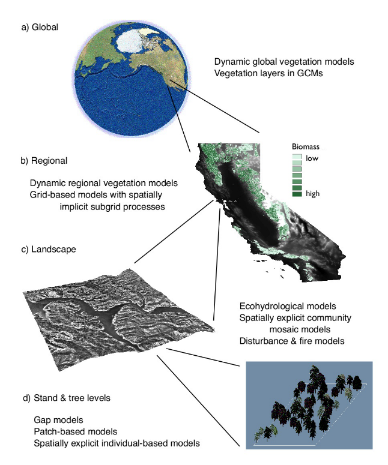
***
**Terrestial biosphere models/ Ecosystem models**: computer models used to predict the states and dynamics of terrestial ecosystems

What processes should we include in our models?    

- Submodels
- Spatial Scales
- Temporal Scales
- Contrasts

Ecophysiological Models
========================================================

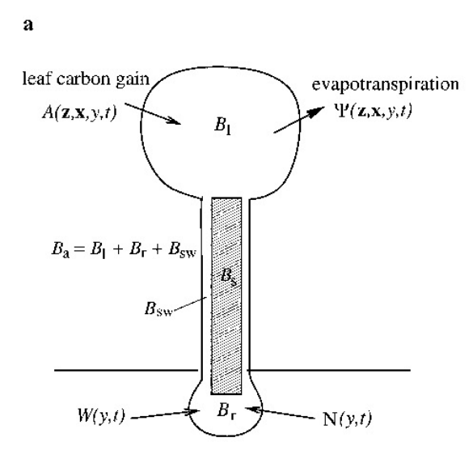
***
* Conservation of mass
  + Pools and fluxes
  + Carbon, water, N, P
  + Not individual trees
* Photosynthesis/GPP
  + Enzyme Kinetic, LUE

Ecophysiological Models: Photosynthesis
========================================================
**Enzyme Kinetic (Farquhar model)**       
$$ A = f(PAR,CO2,RH) $$
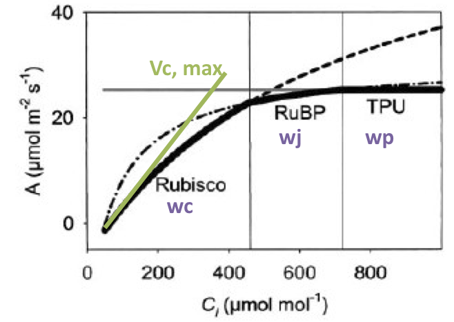
Long and Bernacchi, 2003
***
**Light use efficiency (LUE)**    
$$ A = LUE*PAR*M(env) $$

**To calculate GPP**    
$$ GPP = A * LAI $$

Ecophysiological Models cont.
========================================================

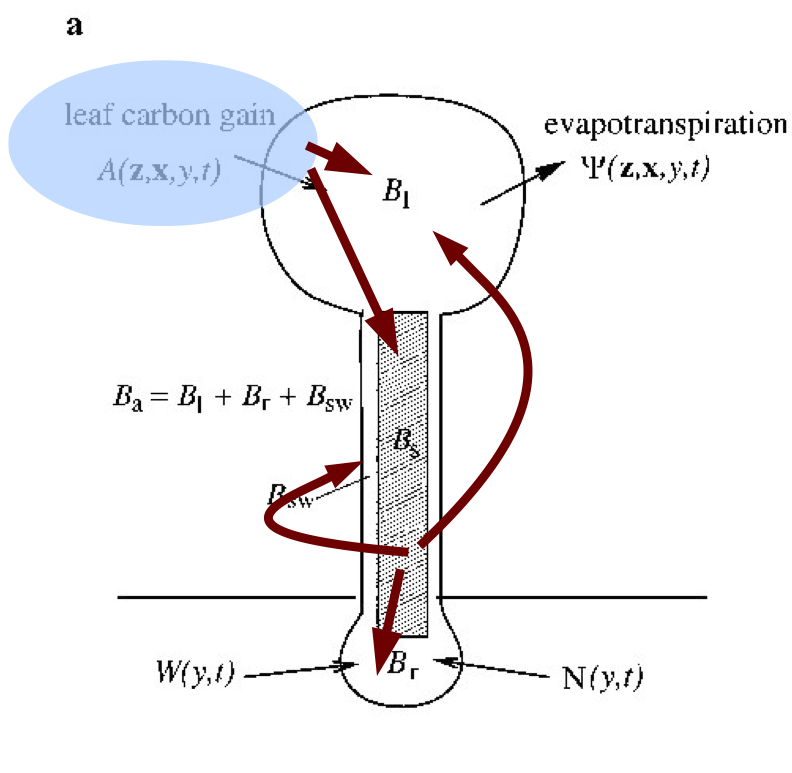
***
* Conservation of mass
  + Pools and fluxes
  + Carbon, water, N, P
  + Not individual trees
* Photosynthesis/GPP
  + Enzyme Kinetic, LUE
* Allocation/Allometry

Ecophysiological Models cont.
========================================================

***
* Conservation of mass
  + Pools and fluxes
  + Carbon, water, N, P
  + Not individual trees
* Photosynthesis/GPP
  + Enzyme Kinetic, LUE
* Allocation/Allometry
* Respiration = f(pool size)
  + $$NPP = GPP - Ra$$ 
* Turnover

Biogeochemical models: Century (carbon)
========================================================
Right: 35%
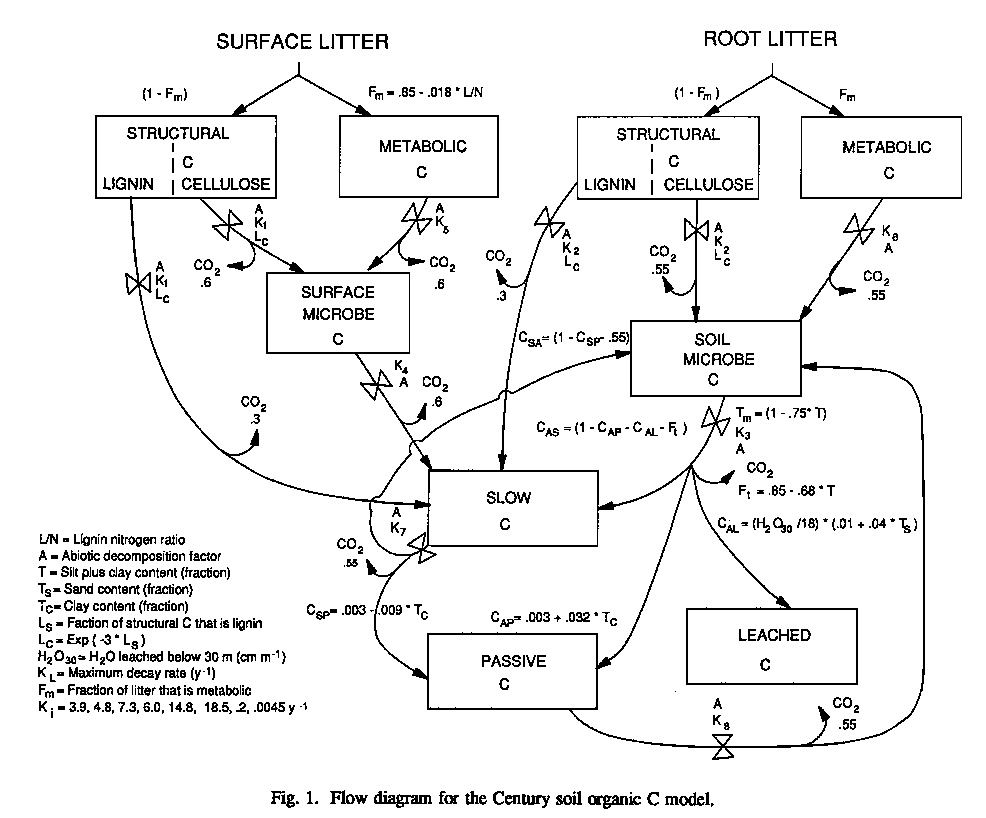
***
Modified by:
 - Temperature
 - Moisture
 - C:N
 - Lignin

Recall that
$$NPP = GPP - Ra$$
With BGC model
$$NEP = NPP - Rh$$

Biogeochemical models: TECO
========================================================
Right: 40%
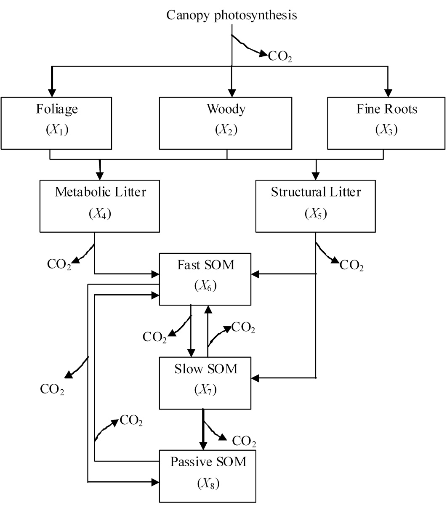
***
TECO model components:
 - Plant ecophysiology
 
 - Soil biogeochemistry
 
Land Surface Model
========================================================
Right: 35%

***
- Exchange of energy and moisture between land and atmosphere
- Originally developed for atm models
- Static vegetation
- Fast time step

Land Surface Model
========================================================
Right: 45%

***
Flux = g * DX
- g = Conductance
- DX is concentration gradient
- Leaf in → out
- Leaf surf → canopy air space (CAS)
- Soil → CAS
- Between soil layers
- Within snow
- CAS → ATM

Leaf Energy Balance
========================================================

T = Temperature   
a = absorptivity   
e = emissivity   
L = latent heat of vaporization   
C = heat capacity   
z = solar zenith angle   

Forest Gap Models
========================================================
Right: 45%

***
- Individual based
- Multiple spp or pft within a patch
- Height structured competition
- 1D or 3D light
- Demographic
- Succession
- Disturbance

Spatial Scale
========================================================
* Individual
  + Spatially explicit
* Patch
  + ~10-20m or homogeneous stand
* Landscape
  + Collection of patches, topography, disturbance, land use
* Region/Globe
  + Coarse grid cells

Temporal Scale
========================================================
* Subdaily
  + Land surface
  + Photosynthesis
* Daily to monthly
  + Allocation, respiration, BGC, phenology
* Seasonal to interannual
  + Growth, mortality, reproduction
  + Disturbance
  + Dispersal / migration

Linking processes at different scales
========================================================
Right: 15%
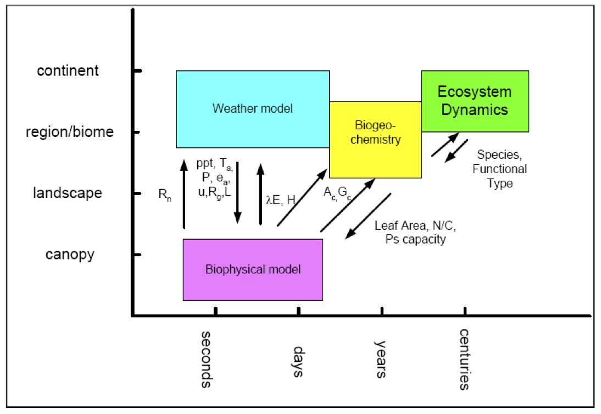    
***
<small> *Diagram by Dennis Baldocchi* </small>

Contrasts
========================================================
- Phenomenologic vs Mechanistic
- Stochastic vs Deterministic
- Diagnostic vs Prognostic
- Point vs Area

========================================================
<small> Table 1 in Dietze and Latimer (2012) Forest Simulators. In Encyclopedia of Theoretical Ecology. University of California Press.</small>

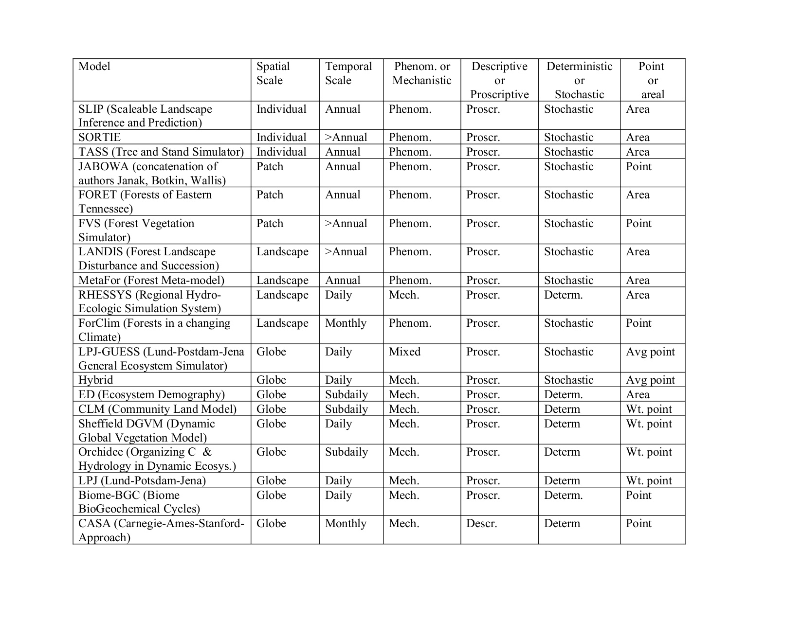

Research objectives --> model choice
========================================================
 - Ecosystem models represent processes differently, at differnt spatial and temporal scales, with different attributes
 - **Examples**: SIPNET vs Community Land Model (CLM) vs Ecological Demography 2 (ED2)

Data Requirements and parameterization
========================================================

Data Requirements
========================================================
* Meteorology (subdaily or daily)
  + Temperature, precip
  + Humidity, solar radiation, CO2
  + Long wave, wind speed, pressure
* Initial Conditions
  + Vegetation: biome, PFT, spp
  + Data driven vs spin-up
* Disturbance/Land Use
* N deposition

Parameterization
========================================================
Right: 30%
<!---
List 5 parameter values
Overparameterized

or could do the Bonan 2008 Ecological Climatology. Cambridge picture
-->

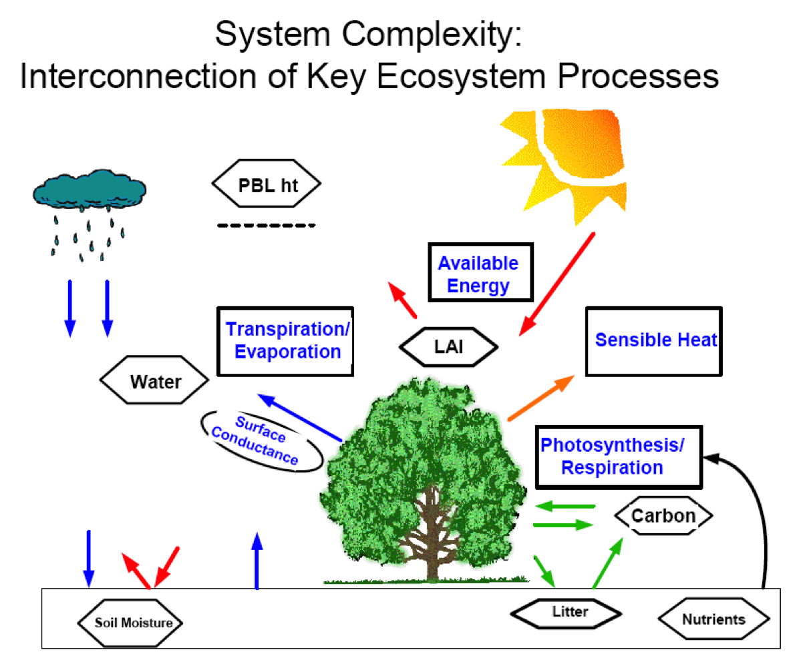
***

Parameter values you need to know before you could make predictions using a model like this?

<small> *Diagram by Dennis Baldocchi* </small>

Parameterization
========================================================
* Approaches
  + Literature-based (ad hoc or meta-analysis)
  + Tuning
  + Optimization (single best estimate)
  + Model-data fusion / Data Assimilation (uncertainties)
* Data
  + Eddy flux (instantaneous to interannual)
  + Forest inventory (annual to decadal)
  + Other ground based measurements (inst. to interann.)
  + Experimental manipulations (FACE, N, precip)
  + Remote sensing (daily to interannual)

Long-term Dynamics
========================================================
* Under-constrained
* Occasionally chronosequence, few paleo
* Biogeochemistry
  + Slow soil C pools take centuries to equilibrate
* Gap/Landscape:
  + Succession is decades to centuries
  + Patch mosaic, shifts in disturbance regime
  
Paleo modeling examples
========================================================

Data-model comparison: past veg. change
========================================================
Right: 60%
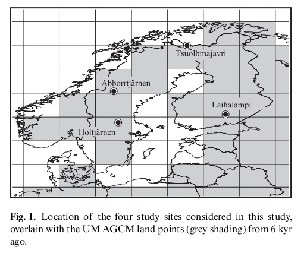
<small> Miller et al. (2008) Exploring climatic and biotic controls on Holocene vegetation change in Fennoscandia. Journal of Ecology </small>
***
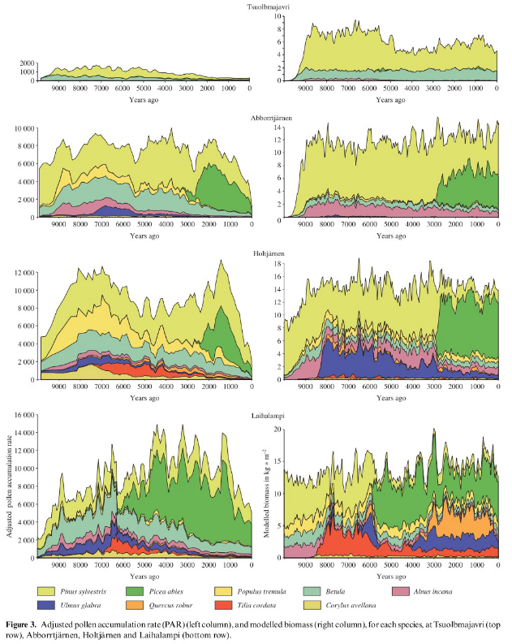

Migration and vegetation dynamics
========================================================

<small> Lehsten, Doerte, et al. (2014) "Modelling the Holocene migrational dynamics of *Fagus sylvatica* L. and *Picea abies* (L.) H. Karst." Global Ecology and Biogeography. </small>

Reconstructing terrestial carbon storage
========================================================
Right: 55%
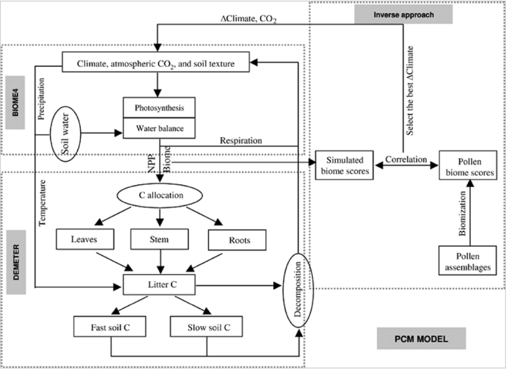
<small> Wu et al. (2009) New coupled model used inversely for reconstructing past terrestrial carbon storage from pollen data: validation of model using modern data. Global Change Biology, 15, 82-96 .</small>
***
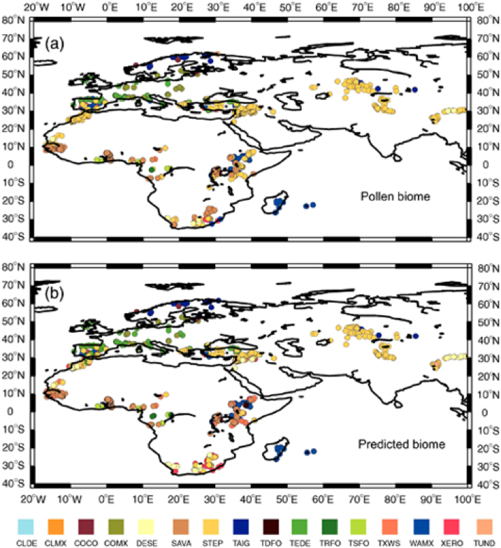

Reconstructing paleoclim. and paleoveg.
========================================================
Right: 55%
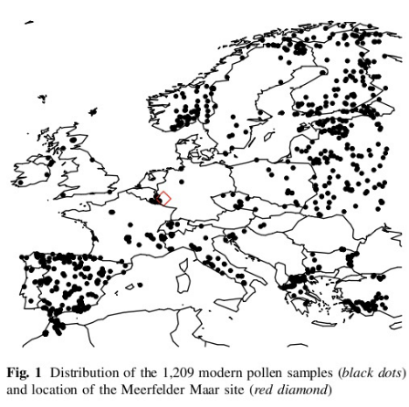
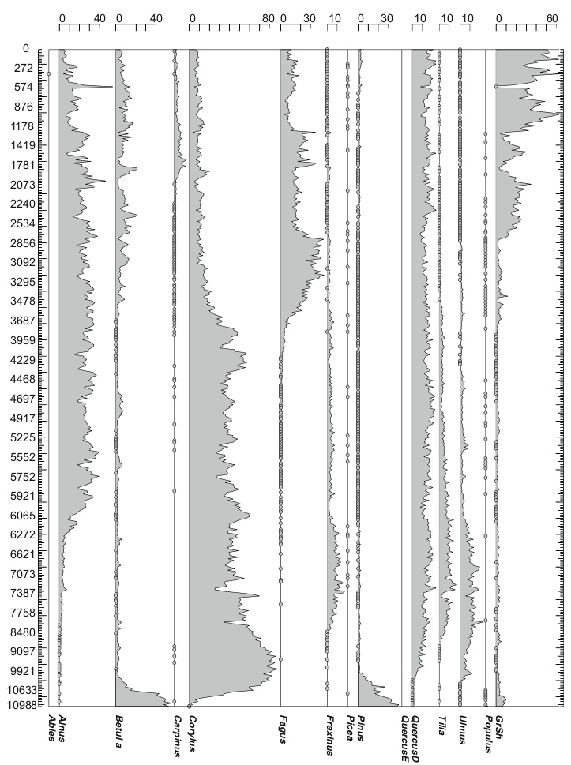
***
Garreta et al., 2009
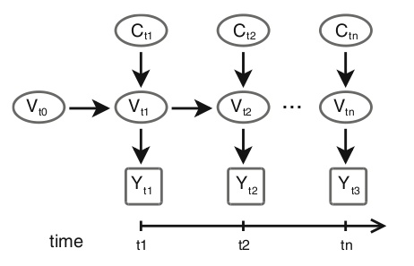

PalEON Modeling Objectives
========================================================

PalEON Modeling Objectives
========================================================
> <small> “[L]ike many areas of climate change science, but unlike most areas of ecology, the understanding of biosphere-atmosphere interactions fundamentally relies on the predictions of large, complex models whose parameters are difficult to measure, and that make predictions at scales far larger than we are typically able to make measurements. As a result, the findings of terrestrial biosphere modeling studies are usually appropriately couched in terms of ‘potential feedback mechanisms’. Indeed, a harsh, but not entirely unwarranted, view would be that our current understanding of biosphere-atmosphere feedbacks is a collection of interesting, but largely untested, hypotheses for the future state of terrestrial ecosystems and climate.” .</small>

> Moorcroft et al.(2006)

Validation
========================================================
How well do current models simulate decadal-to-centennial ecosystem dynamics when confronted with past climate change, and what factors most limit model accuracy?

Activities:   
1. Pre-settlement “potential vegetation” for the region based on running their model to equilibrium   
2. New runs over the PalEON time period under common drivers from a small ensemble of different GCM   
3. Compare models at points and to stats group's gridded data product   

Initialization
========================================================
How sensitive are ecosystem models to initialization state and equilibrium assumptions? Do data-constrained simulations of centennial-scale forest dynamics improve 20th-century simulations? How long does initial condition matter?

Inference
========================================================
What net carbon fluxes are compatible with an observed species composition and disturbance regime? Was the terrestrial biosphere a carbon sink or source during the Little Ice Age and Medieval Climate Anomaly?

With PalEON data products in hand, use data-assimilation to alter the model's state variables and disturbance regime in order to stay “on track” with the observations and take into account the uncertainties in those observations.

Inference
========================================================
**State-variable Data Assimilation**: 

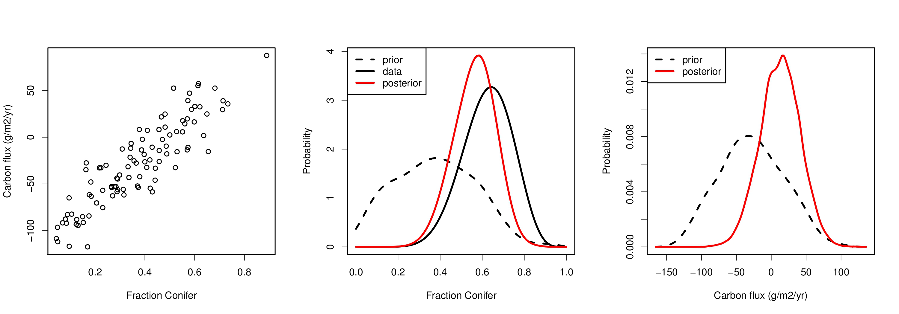

Improvement
========================================================
To what extent does site-level data-model fusion improve regional model projections? Which parameters are most responsible for data-model divergences at decadal to centennial timescales, and how can they be improved? Where can we get most value from future field campaigns?

